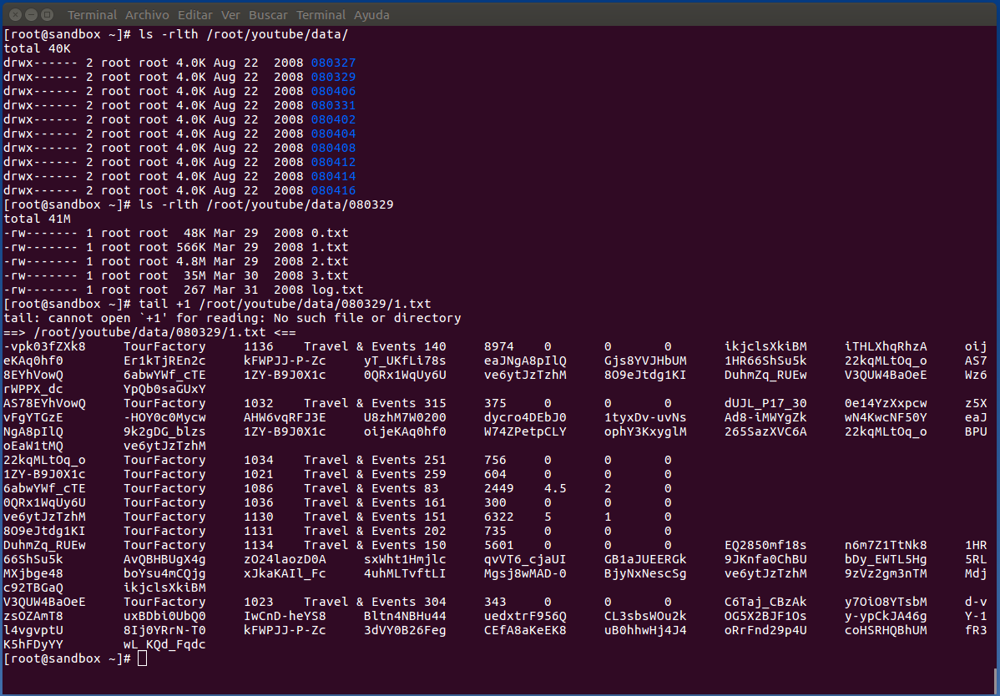
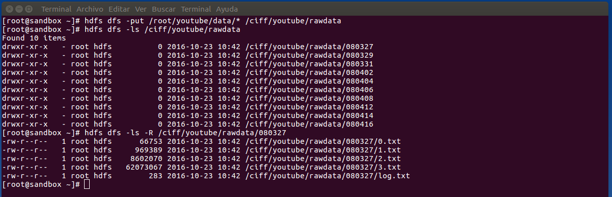
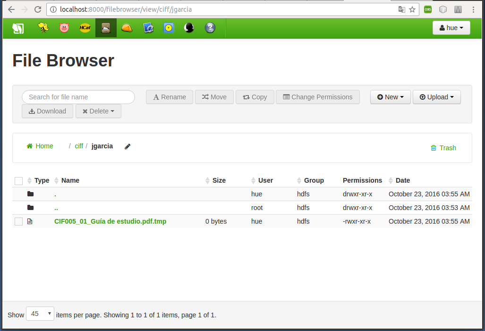
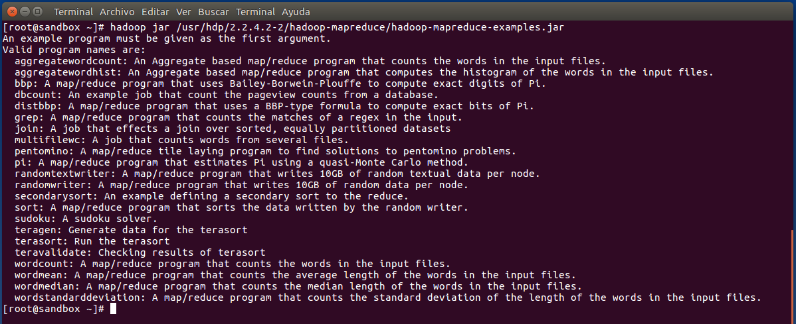
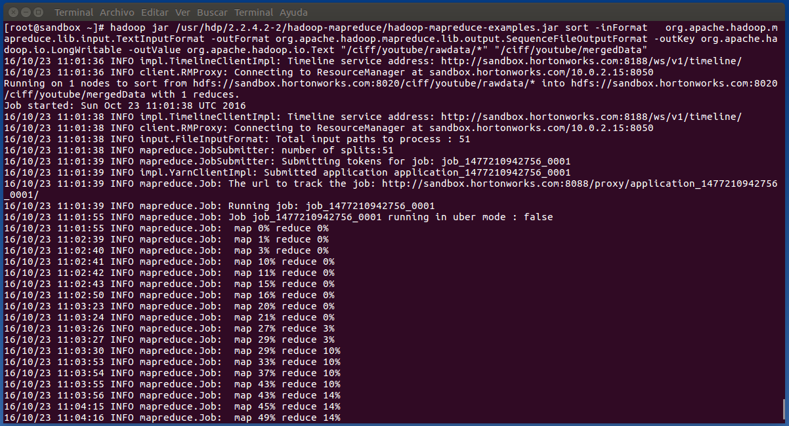
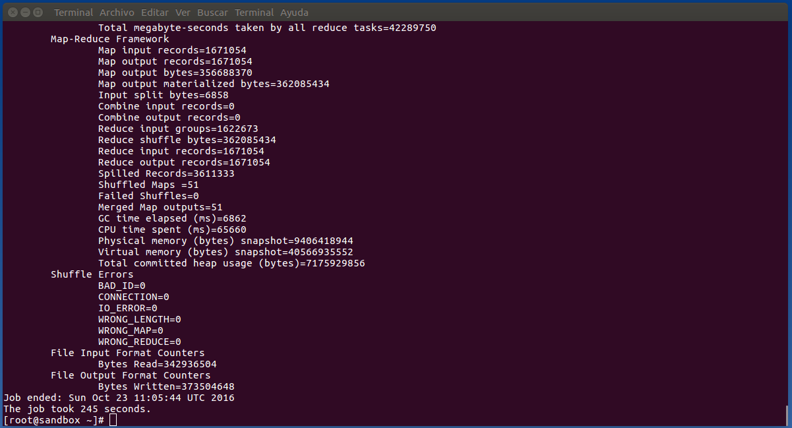
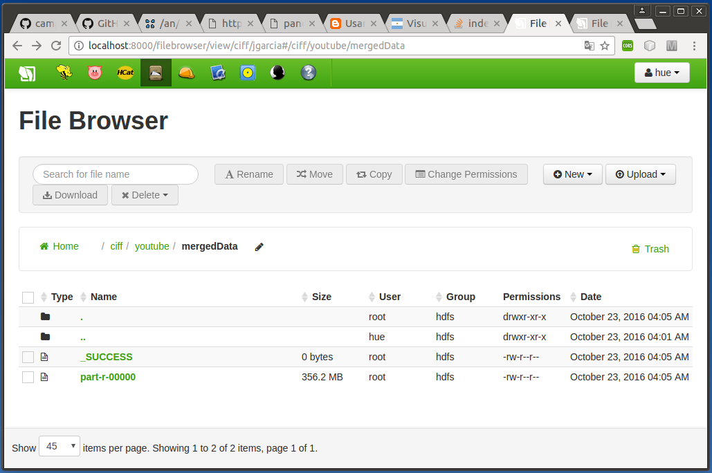
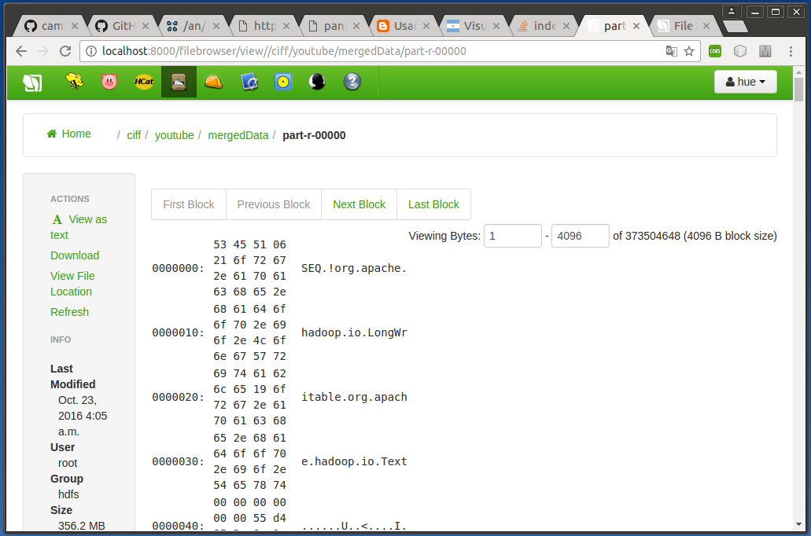

***
# EXTRACTORES DE DATOS
## TRANSFERENCIA DE FICHEROS HDFS
### Sesión 1
***
- Autor: Juan A. García Cuevas
- Fecha: 24/10/2016
***

# Ejercicio 1: Ingesta básica en HDFS

Tenemos un dataset en el directorio local /root/youtube/data que es el resultado (parcial) de un crawler de Youtube (extraído de [http://netsg.cs.sfu.ca/youtubedata/](http://netsg.cs.sfu.ca/youtubedata/)).

El crawler deja los ficheros en carpetas que corresponden a la fecha de adquisición.

Cada carpeta contiene 4 ficheros TXT (Tab delimited) con los campos: video ID, uploader, age, category, length, views, rate, ratings, comments, related ID

```bash
ls -rlth /root/youtube/data/
ls -rtlh /root/youtube/data/080329
ls tail +1 /root/youtube/data/080329/1.txt
```



### 1. Escribe en la consola, un comando hdfs para transferir el dataset completo desde el filesystem local hasta la ruta HDFS /ciff/youtube/rawdata. El resultado en HDFS debe ser un directorio /ciff/youtube/rawdata que contenga todos los directorios de datos:

```bash
hdfs dfs -put /root/youtube/data/* /ciff/youtube/rawdata
hdfs dfs -ls /ciff/youtube/rawdata
hdfs dfs -ls -R /ciff/youtube/rawdata/080327
```



### 2. Comprueba que puedes hacer lo mismo de modo gráfico accediendo a la interfaz web HUE en: http://localhost:8000/filebrowser/. Crea una carpeta con tu nombre dentro de /ciff (por ejemplo /ciff/javieralba) y copia a esa carpeta algún fichero local de tu ordenador.

Nota: la primera vez que accedas a HUE tendrás que crear un usuario/password. Recomendable apuntarlo o usar el mismo que la VM!




***
# Ejercicio 2: Postprocesado básico con MapReduce

Ahora ya tenemos nuestro dataset en HDFS pero consta de muchos ficheros pequeños

HDFS está optimizado para ficheros grandes.

Podemos hacer un postprocesado con un job Mapreduce que tome como entrada todos los ficheros de nuestro dataset y genere un sólo fichero con formato SequenceFile

Este postprocesado es tan básico, que no tenemos que hacer ningún procesamiento de datos, símplemente generar un sólo fichero con los datos en el formato deseado (SequenceFile)

Por lo tanto, en vez de escribir un Mapper y un Reducer, en este caso podemos utilizar el programa mapreduce “sort” ya disponible en/usr/hdp/2.2.4.2-2/hadoop-mapreduce/hadoop-mapreduce-examples.jar) Pista: Necesitarás usar los parámetros –inFormat, -outFormat, -outKey, -outValue

### 1. Ejecuta en la consola un comando para ejecutar el job mapreduce en /usr/hdp/2.2.4.2-2/hadoop-mapreduce/hadoop-mapreduce-examples.jar (pista: busca cómo ejecutar jars en hadoop)


### 2. Al ejecutar sin ningún parámetro, verás que el programa hadoop-mapreduce-examples.jar contiene una lista de diferentes programas de ejemplo. Nosotros queremos ejecutar el programa sort

```bash
hadoop jar /usr/hdp/2.2.4.2-2/hadoop-mapreduce/hadoop-mapreduce-examples.jar
```



### 3. Ejecuta de nuevo el comando, esta vez indicando el programa a ejecutar (sort). Al ejecutarlo sin parámetros, se imprimirá una ayuda de sort, indicando qué parámetros requiere. Recuerda que queremos transformar desde el formato texto plano al formato SequenceFile. También tendrás que indicarle la ruta HDFS de los datos de entrada y la ruta HDFS de salida (/ciff/youtube/processed/mapreduce)

```bash
hadoop jar /usr/hdp/2.2.4.2-2/hadoop-mapreduce/hadoop-mapreduce-examples.jar sort -inFormat   org.apache.hadoop.mapreduce.lib.input.TextInputFormat -outFormat org.apache.hadoop.mapreduce.lib.output.SequenceFileOutputFormat -outKey org.apache.hadoop.io.LongWritable -outValue org.apache.hadoop.io.Text "/ciff/youtube/rawdata/*" "/ciff/youtube/mergedData"
```





### 4. Una vez ejecutado, visualiza en HUE el dataset resultado

Pistas:

- Formato texto plano: 
    - org.apache.hadoop.mapreduce.lib.input.TextInputFormat
- Formato SequenceFile: 
    - org.apache.hadoop.mapreduce.lib.output.SequenceFileOutputFormat
- Tipo de output Key: 
    - org.apache.hadoop.io.LongWritable
- Tipo de output Value: 
    - org.apache.hadoop.io.Text





***
# Referencias
- [https://gist.github.com/fjavieralba/6c4020ffb311cd50f81a](https://gist.github.com/fjavieralba/6c4020ffb311cd50f81a)
***
