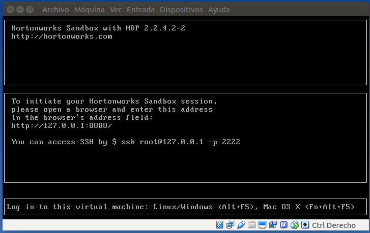
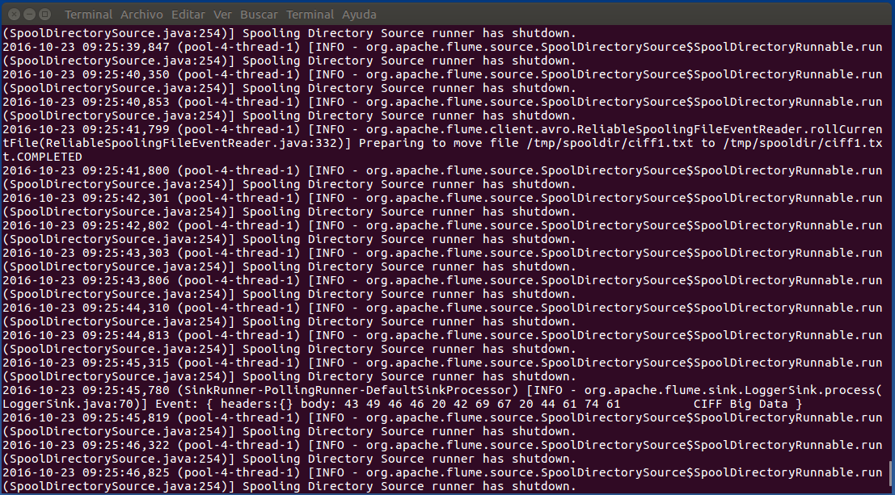
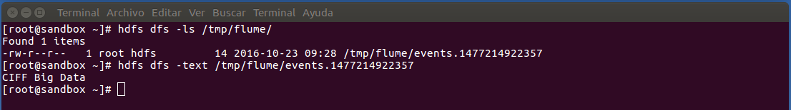
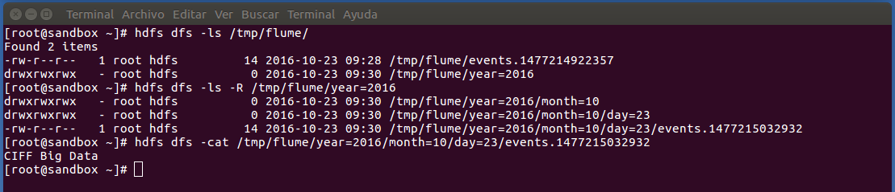
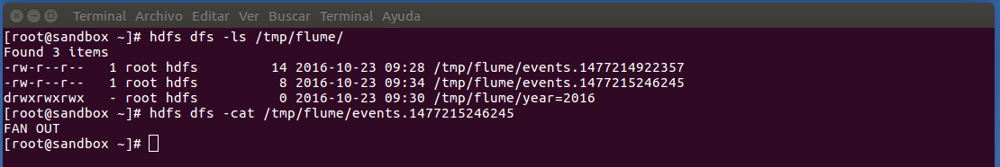
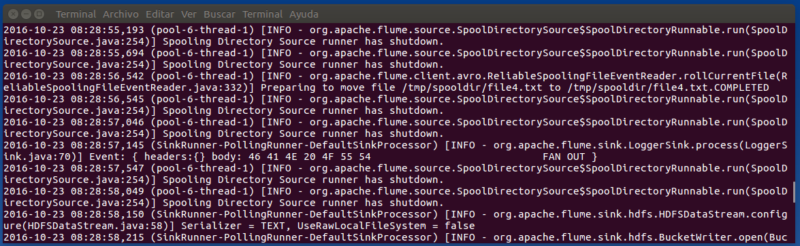

***
# EXTRACTORES DE DATOS
# FLUME
***
- Autor: **Juan A. García Cuevas**
- Fecha: 24/10/2016
- _Correspondiente a sesión 2_

***
# Introducción

**Flume**

- Flume es un servicio distribuido, confiable y disponible para la recolección, agregación y movimiento eficientes de flujos de datos.
- Es utilizado comúnmente para mover datos de logs o grandes cantidades de datos de eventos (redes sociales, eventos de colas de mensajes, o datos de tráfico de red).
- _Flume se usa generalmente como recolector de logs_.

**Agentes Flume**

- Normalmente, una instalación Flume consistirá en una colección de agentes corriendo de forma distribuida.
- Los agentes en los sistemas origen harán la recolección y reenvío de eventos a los agentes responsables de agregar y persistir los datos en el destino final
- El uso de Flume se reduce en muchas ocasiones a un ejercicio de configuración de cómo queremos unir las distintas piezas de la topología

***
# Ejercicio 1: Spooldir

Ejemplo simple que:

- Monitoriza un directorio local en busca de nuevos ficheros de texto.
- Según se van añadiendo ficheros, envía cada línea de cada fichero a consola.

### 1. Iniciamos la máquina virtual y accedemos a ella (root/hadoop)

Iniciamos la máquina virtual de la asignatura, configurada previamente (extractores_datos_ciff).



Abrimos dos terminales en nuestra máquina principal para conectarnos (mediante ssh) a la máquina virtual:

- Un terminal lo utilizaremos para ejecutar ls agentes de Flume y visualizar los log que van escribiendo por pantalla.
- El otro terminanal lo usaremos para realizar las operaciones con ficheros que queremos monitorizar.

En los dos terminales nos conectamos a la máquina virtual mediante la siguiente instrucción:

```bash
ssh root@localhost -p 2222
# password: "hadoop"
```

### 2. Creamos el fichero de configuración de Flume: /etc/flume/conf/spool-to-logger.properties

```bash
vim /etc/flume/conf/spool-to-logger.properties
```
```
agent1.sources = source1
agent1.sinks = sink1
agent1.channels = channel1
agent1.sources.source1.channels = channel1
agent1.sinks.sink1.channel = channel1
agent1.sources.source1.type = spooldir
agent1.sources.source1.spoolDir = /tmp/spooldir
agent1.sinks.sink1.type = logger
agent1.channels.channel1.type = file
```

### 3. Creamos el directorio de trabajo

```bash
mkdir /tmp/spooldir
```

### 4. Iniciamos el agente Flume

```bash
flume-ng agent --conf-file /etc/flume/conf/spool-to-logger.properties --name agent1 --conf /etc/flume/conf/ -Dflume.root.logger=INFO,console
```

### 5. En la segunda consola creamos un fichero en spooldir (en dos pasos)

```bash
echo "CIFF Big Data" > /tmp/spooldir/.ciff1.txt
mv /tmp/spooldir/.ciff1.txt /tmp/spooldir/ciff1.txt
```

### 6. Comprobamos que los eventos se reflejan en la salida del logger (en la consola donde hemos arrancado el agente flume)



***
# Ejercicio 2: HDFS Sink

Modificamos el ejemplo anterior para escribir los eventos en HDFS.

### 1. Copiamos el fichero de configuración anterior en un nuevo fichero spool-to-hdfs.properties y lo editamos, modificando el sink:

```bash
vim /etc/flume/conf/spool-to-hdfs.properties
```
```
agent1.sources = source1
agent1.sinks = sink1
agent1.channels = channel1
agent1.sources.source1.channels = channel1
agent1.sinks.sink1.channel = channel1
agent1.sources.source1.type = spooldir
agent1.sources.source1.spoolDir = /tmp/spooldir
agent1.sinks.sink1.type = hdfs
#especificamos la ruta destino en hdfs:
agent1.sinks.sink1.hdfs.path = /tmp/flume
#prefijo para los ficheros que cree flume
agent1.sinks.sink1.hdfs.filePrefix = events
#prefijo para los ficheros que estan siendo escritos:
agent1.sinks.sink1.hdfs.inUsePrefix = _
#tipo de fichero de salida, en este caso queremos texto plano:
agent1.sinks.sink1.hdfs.fileType = DataStream
agent1.channels.channel1.type = file
```

### 2. Iniciamos el agente Flume con esta nueva configuración

```bash
flume-ng agent --conf-file /etc/flume/conf/spool-to-hdfs.properties --name agent1 --conf /etc/flume/conf/ -Dflume.root.logger=INFO,console
```

### 3. Creamos un nuevo fichero en el spooldir, y comprobamos que Flume escribe el log en la ruta HDFS que le hemos indicado por configuración

```bash
echo "CIFF Big Data" > /tmp/spooldir/.ciff2.txt
mv /tmp/spooldir/.ciff2.txt /tmp/spooldir/ciff2.txt
```

### 4. Una vez que el fichero ya no esté siendo procesado por Flume (30 segundos), comprobamos el contenido del mismo

```bash
hdfs dfs -ls /tmp/flume/
hdfs dfs -cat /tmp/flume/events.1477214922357
```



***
# Ejercicio 3: Particionado

Modificamos el ejemplo anterior para que Flume particione los eventos en HDFS en base al campo timestamp de cada evento.

Por defecto, los eventos no tienen timestamp, lo añadiremos con un interceptor ya implementado en Flume.

Esto puede ser útil cuando estos datos se van a consultar por ejemplo desde Hive.

### 1. Copiamos el fichero de configuración anterior en un nuevo fichero spool-to-hdfs-partitioned.properties y lo editamos, modificando la propiedad hdfs.path del sink y añadiendo un interceptor de tipo timestamp:

```bash
vim /etc/flume/conf/spool-to-hdfs-partitioned.properties
```
```
agent1.sources = source1
agent1.sinks = sink1
agent1.channels = channel1
agent1.sources.source1.channels = channel1
agent1.sinks.sink1.channel = channel1
agent1.sources.source1.type = spooldir
agent1.sources.source1.spoolDir = /tmp/spooldir
agent1.sinks.sink1.type = hdfs
#especificamos la ruta destino en hdfs:
agent1.sinks.sink1.hdfs.path = /tmp/flume/year=%Y/month=%m/day=%d
#interceptor para el timestamp:
agent1.sources.source1.interceptors = interceptor1
agent1.sources.source1.interceptors.interceptor1.type = timestamp
#prefijo para los ficheros que cree flume:
agent1.sinks.sink1.hdfs.filePrefix = events
#prefijo para los ficheros que estan siendo escritos:
agent1.sinks.sink1.hdfs.inUsePrefix = _
#tipo de fichero de salida, en este caso queremos texto plano:
agent1.sinks.sink1.hdfs.fileType = DataStream
agent1.channels.channel1.type = file
```

### 2. Iniciamos el agente Flume con la nueva configuración

```bash
flume-ng agent --conf-file /etc/flume/conf/spool-to-hdfs-partitioned.properties --name agent1 --conf /etc/flume/conf/ -Dflume.root.logger=INFO,console
```

### 3. Creamos un nuevo fichero en el spooldir, y comprobamos que Flume lo escribe en HDFS, creando las rutas con las distintas particiones por año, mes y día

```bash
echo "CIFF Big Data" > /tmp/spooldir/.ciff3.txt
mv /tmp/spooldir/.ciff3.txt /tmp/spooldir/ciff3.txt
```

```bash
hdfs dfs -ls /tmp/flume/
hdfs dfs -ls -R /tmp/flume/year=2016
hdfs dfs -cat /tmp/flume/year=2016/month=10/day=23/events.1477215032932
```



***
# Ejercicio 4: Fan Out
***

Modificamos el ejemplo anterior para que Flume utilice 2 “channels”, uno de tipo fichero y otro en memoria.

Utilizaremos también 2 sinks: uno para escribir en HDFS (“producción”) y otro para depurar con un logger en consola.

No queremos perder eventos de producción pero no nos importa perder alguno de depuración

### 1. Creamos un nuevo fichero de configuración de flume (spool-fanout.properties) con 2 channels y 2 sinks:

```bash
vim /etc/flume/conf/spool-fanout.properties
```
```
agent1.sources = source1
agent1.sinks = sinkHdfs sinkLogger
agent1.channels = fileChannel memoryChannel
agent1.sources.source1.channels = fileChannel memoryChannel
agent1.sinks.sinkHdfs.channel = fileChannel
agent1.sinks.sinkLogger.channel = memoryChannel
agent1.sources.source1.type = spooldir
agent1.sources.source1.spoolDir = /tmp/spooldir
agent1.sinks.sinkHdfs.type = hdfs
agent1.sinks.sinkHdfs.hdfs.path = /tmp/flume
agent1.sinks.sinkHdfs.hdfs.filePrefix = events
agent1.sinks.sinkHdfs.hdfs.fileType = DataStream
agent1.sinks.sinkLogger.type = logger
agent1.channels.fileChannel.type = file
agent1.channels.memoryChannel.type = memory
```

### 2. Iniciamos el agente Flume con la nueva configuración

```bash
flume-ng agent --conf-file /etc/flume/conf/spool-fanout.properties --name agent1 --conf /etc/flume/conf/ -Dflume.root.logger=INFO,console
```

### 3. Creamos un nuevo fichero en el spooldir, y comprobamos que Flume escribe eventos en los dos destinos: HDFS y Logger 

```bash
echo "FAN OUT" > /tmp/spooldir/.file4.txt
mv /tmp/spooldir/.file4.txt /tmp/spooldir/file4.txt
```

```bash
hdfs dfs -ls /tmp/flume/
hdfs dfs -cat /tmp/flume/events.1477214922357
```





***
# Referencias
- [https://gist.github.com/fjavieralba/6c81b856c3d6ed36b2c3](https://gist.github.com/fjavieralba/6c81b856c3d6ed36b2c3)

***
