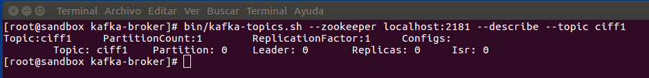

***
# EXTRACTORES DE DATOS
# Apache KAFKA
***
- Autor: **Juan A. García Cuevas**
- Fecha: 06/11/2016
- _Correspondiente a la sesión 3_

***
# Introducción

## Apache Kafka 

Apache Kafka es un proyecto de código abierto desarrollado por la Apache Software Foundation y escrito en Scala.

Su objetivo es proporcionar una plataforma unificada, de alto rendimiento y baja latencia, para la manipulación en tiempo real de fuentes de datos. Puede verse como una cola de mensajes, bajo el patrón publicación-suscripción, concebida como un registro de transacciones distribuidas y altamente escalable, características muy atractivas para las infraestructuras de aplicaciones empresariales.

## Iniciamos la máquina virtual y accedemos a ella (root/hadoop)

Iniciamos la máquina virtual de la asignatura, configurada previamente (extractores_datos_ciff).


***
## Ejercicio 1: Operaciones básicas

** Abrimos un terminal e iniciamos un broker kafka indicando el fichero de configuración **
```bash
ssh root@localhost -p 2222 # pwd: hadoop
cd /usr/hdp/current/kafka-broker/
./bin/kafka-server-start.sh config/server.properties
```

** Abrimos una nueva consola para probar los demás comandos de kafka **
```bash
ssh root@localhost -p 2222 # pwd: hadoop
cd /usr/hdp/current/kafka-broker/
```

### Kafka incluye algunos scripts útiles para interactuar con el cluster. Por ejemplo, el script "_/usr/hdp/current/kafka-broker/bin/kafka-topics.sh_" se utiliza mucho, por ejemplo, para crear un topic.

** Ejecutamos el script _kafka-topics.sh_ sin parámetros para que muestre todas las opciones que se le pueden pasar **
```bash
./bin/kafka-topics.sh
```


Podemos ver que la opción --zookeeper es obligatoria. En nuestro caso le pasaremos siempre **--zookeeper localhost:2181**

** Creamos un topic denominado ciff1 con una sóla partición y con factor de replicación 1 **
```bash
./bin/kafka-topics.sh --zookeeper localhost:2181 --create localhost:2181 --topic ciff1 --partitions 1 --replication-factor 1
```


** Mostramos un listado de los topicos actuales **
```bash
./bin/kafka-topics.sh --zookeeper localhost:2181 --list
```


** Mostramos la descripción del tópico recién creado **
```bash
./bin/kafka-topics.sh --zookeeper localhost:2181 --describe --topic ciff1
```


### Kafka también incorpora algunos scripts útiles para producir y consumir mensajes del cluster.

** Ejecutamos el script _kafka-producer.sh_ sin parámetros para que muestre todas las opciones que se le pueden pasar **
```bash
./bin/kafka-producer.sh
```


Podemos ver que la opción --broker-list es obligatoria. En nuestro caso le pasaremos siempre --broker-list sandbox.hortonworks.com:6667

** Iniciamos console producer y enviamos algunos mensajes al topic ciff1 **

```bash
./bin/kafka-console-producer.sh --broker-list sandbox.hortonworks.com:6667 --topic ciff1
```
```txt
1- texto escrito antes de lanzar ningún consumer
```

** Abrimos un consumer en una nueva consola para consumir los nuevos mensajes que se envíen **

```bash
ssh root@localhost -p 2222 # pwd: hadoop
cd /usr/hdp/current/kafka-broker/
./bin/kafka-console-consumer.sh --zookeeper localhost:2181 --topic ciff1
```
Comprobamos que en la consola del consumer no aparece la línea escrita anteriormente en el producer.

Ahora escribimos una nueva línea de texto en la consola del producer y vemos que aparece en la consola del consumer:

```txt
2- texto escrito después de lanzar el primer consumer
```

Comprobamos que en la consola del consumer aparece la línea recién escrita en el producer.

** Abrimos un consumer en una nueva consola para consumir todos los mensaje, incluso los anteriores **

```bash
ssh root@localhost -p 2222 # pwd: hadoop
cd /usr/hdp/current/kafka-broker/
./bin/kafka-console-consumer.sh --zookeeper localhost:2181 --topic ciff1 --from-beginning
```

Comprobamos que en la consola del nuevo consumer aparecen las dos líneas escritas anteriormente en el producer.

Ahora escribimos una nueva línea de texto en la consola del producer y vemos que ésta aparece en las consolas de los dos consumer:

```txt
3- texto escrito después de lanzar el segundo consumer
```


***

