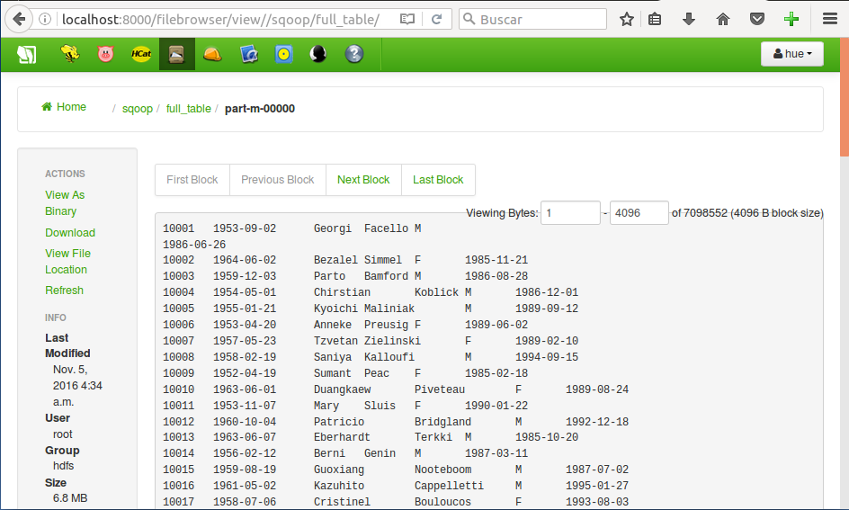

***
# EXTRACTORES DE DATOS
# Apache SQOOP
***
- Autor: **Juan A. García Cuevas**
- Fecha: 06/11/2016
- _Correspondiente a sesión 4_

***
# Introducción

##Sqoop##

Apache Sqoop es una aplicación con interfaz de línea de comando que se utiliza para transferir datos entre bases de datos relacionales y Hadoop.

Con las importaciones se transfieren datos desde una base de datos relacional a Hadoop. Soporta cargas incrementales de una sola tabla o de una consulta SQL en formato libre, así como trabajos almacenados que pueden ser ejecutados múltiples veces para importar las actualizaciones realizadas en una base de datos desde la última importación. Las importaciones también pueden poblar tablas en Hive o HBase.

Las exportaciones pueden utilizarse para transferir datos desde Hadoop hacia a una base de datos relacional.

El nombre Sqoop viene de fusionar las palabras sql y hadoop. Sqoop se convirtió en un proyecto Apache de nivel superior en marzo de 2012.

Sqoop viene con una amplia documentación para usuarios y desarrolladores:

- [https://sqoop.apache.org/docs/1.4.5/SqoopUserGuide.html](https://sqoop.apache.org/docs/1.4.5/SqoopUserGuide.html)

##Preparación del ejercicio##

Para poder probar la herramienta necesitaremos tener acceso a una base de datos. Por ello, descargaremos de internet una base de datos de empleados y la importaremos en el servidor MySql de la máquina virtual:

### 1. Iniciamos la máquina virtual y accedemos a ella (root/hadoop)

Iniciamos la máquina virtual de la asignatura, configurada previamente (extractores_datos_ciff).


Abrimos un terminal en nuestra máquina principal para conectarnos (mediante ssh) a la máquina virtual:
```bash
ssh root@localhost -p 2222 # pwd: hadoop
```

### 2. Descargamos e instalamos la base de datos

Descargamos la BBDD de ejemplo:
```bash
wget https://launchpad.net/test-db/employees-db-1/1.0.6/+download/employees_db-full-1.0.6.tar.bz2
```

La descomprimimos y cargarmos en MsSql:
```bash
tar xjfv employees_db-full-1.0.6.tar.bz2
cd employees_db
mysql -t < employees.sql
```

Damos permisos en MySql:
```bash
mysql
```
```sql
GRANT ALL PRIVILEGES ON employees.* TO ''@'localhost';
quit
```

***
# Ejercicio 1: Sqoop help, tools e interacción con BBDD

Sqoop proporciona varias herramientas. Con el comando _**help**_ se puede obtener ayuda de cada una de ellas. Se puede ver la lista de comandos disponibles ejecutando _**sqoop help**_, y **_sqoop help < comando >_** para obtener ayuda específica de cada comando.

Mostramos la ayuda del comando sqoop:
```bash
sqoop help
```


Listamos las bases de datos en el RDBMS (necesitamos indicar el driver JDBC con la opción --connect jdbc:mysql://localhost/employees):
```bash
sqoop list-databases --connect jdbc:mysql://localhost/employees
```


Listamos las tablas de nuestra BBDD:
```bash
sqoop list-tables --connect jdbc:mysql://localhost/employees
```


***
# Ejercicio 2: Importaciones básicas

**sqoop-import** es la herramienta utilizada para importar datos desde una BBDD a HDFS

1. Revisar la ayuda del comando import, y ejecutar una importación de la tabla employees, utilizando un solo mapper. Comprobar que se han generado los datos (http://localhost:8000/filebrowser/view//user/root/employees/part-m-00000)

2. Importar ahora la misma tabla pero en el directorio HDFS /sqoop/full_table, utilizando 2 mappers y con los campos delimitados por tabulador (“\t”). Comprobar los ficheros generados en HDFS en el directorio destino (ahora debería haber 2 ficheros) y que el formato es diferente (tabuladores en vez de comas). Revisar el fichero employees.java que Sqoop ha generado automáticamente.

Mostramos la ayuda de la opción import del comando sqoop:
```bash
sqoop help import
```

Nos conectamos a la tabla employees de la base de datos employees con 1 map y copiamos los datos:
```bash
sqoop import --connect jdbc:mysql://localhost/employees --table employees -m 1
```


Nos conectamos a la tabla employees de la base de datos employees con 1 map y copiamos los datos en el fichero /sqoop/full_table de HDFS, separándolos con el caracter tabulador:
```bash
sqoop import --connect jdbc:mysql://localhost/employees --table employees -m 2 --fields-terminated-by "\t" --target-dir /sqoop/full_table
```




***
# Ejercicio 3: Filtrando columnas y filas

Si no queremos importar tablas completas, sqoop-import permite importar sólo algunas columnas.

También es posible filtrar los datos de alguna añadiendo cláusulas WHERE al job de importación o incluso añadiendo una query arbitraria.

Importamos sólo las columnas first_name y last_name en el directorio HDFS /sqoop/some_columns. Comprobamos que los ficheros generados en HDFS, verificando que sólo estén las columnas seleccionadas:
/sqoop/some_columns de HDFS:
```bash
sqoop import --connect jdbc:mysql://localhost/employees --table employees --columns first_name,last_name -m 2 --fields-terminated-by "\t" --target-dir /sqoop/some_columns
```


Importamos en /sqoop/recent_employees los empleados que tengan el campo emp_no mayor de 499948. Comprobamos que los ficheros de salida cumplen la condición del WHERE:
```bash
sqoop import --connect jdbc:mysql://localhost/employees --table employees --where "emp_no>499948" --fields-terminated-by "\t" --warehouse-dir /sqoop/recent_employees
```


# Ejercicio 4: Importación a Hive

Borramos el contenido de /user/root/employees en HDFS (para que no interfiera con este ejercicio)

Ejecutamos una importación de todas las tablas directamente a Hive y comprobamos que los datos son accesibles desde Hive (http://localhost:8000/beeswax/), verificando que se van creando las tablas en la BD “default” (show tables;) y que se pueden hacer queries.

```bash
sqoop import-all-tables --connect jdbc:mysql://localhost/employees --hive-import --warehouse-dir /sqoop/hive
```


***
## Parámetros utilizados en los comandos sqoop

- Url de la base de datos: **--connect jdbc:mysql://localhost/employees**
- Nombre de la tabla: **--table employees**
- Condición para fitrar las filas de la tabla a importar: **--where "emp_no>499948"**
- Caracter de separación entre columnas: **--fields-terminated-by "\t"**
- Ruta (directorio/.../fichero) donde se guardará la información importada en HDFS: **--warehouse-dir /sqoop/recent_employees**
- Columnas a importar de la tabla: **--columns first_name,last_name**
- Número de procesos map: **-m 2**

***
