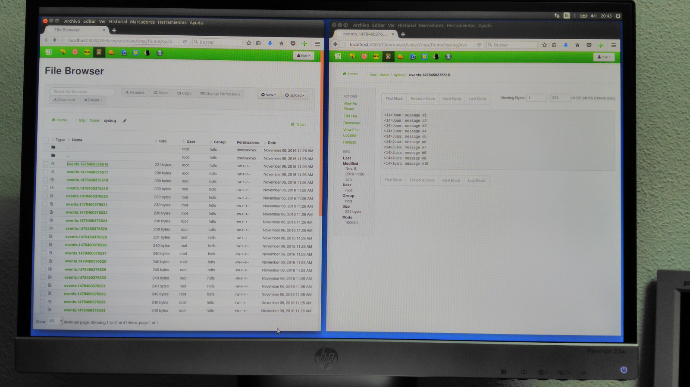

# Adquisición de Datos - Práctica Final
***
- Autor: **Juan A. García Cuevas**
- Fecha: 06/11/2016

***
#Ejercicio 1

En este ejercicio vamos a utilizar Flume para consumir eventos syslog y almacenarlos en HDFS.

> Nota: antes de nada arrancamos la máquina virtual.

#### 1. Crear un nuevo fichero de configuración de Flume (en el directorio /etc/flume/conf/) que tenga como source eventos Syslog en el puerto UDP 5140 y como destino el directorio /tmp/flume/syslog de HDFS.

En http://flume.apache.org/FlumeUserGuide.html#syslog-udp-source se pueden consultar los parámetros de configuración necesarios y un ejemplo.


- **Abrimos un terminal y nos conectamos a la máquina virtual (pwd: hadoop):**
```bash
ssh root@localhost -p 2222
```

- **Ejecutamos el siguiente comando para evitar que ejecuciones de anteriores ejercicios afecten a este:**
```bash
rm -rf ~/.flume/file-channel/*
```

- **Creamos un directorio de trabajo y nos movemos a él:**
```bash
mkdir PracticaFinal
cd PracticaFinal
```

- **Descargamos el script python con el que vamos a generar eventos syslog:**
```bash
wget https://gist.github.com/fjavieralba/ab129e84241623916acd/raw/fd0e221e22a6355453a18b213c74e386c58d9a5f/syslog_generator.py
```

- **Creamos un fichero de configuración de Flume (en el directorio /etc/flume/conf/) (a partir de otro fichero de configuración existente: spooldir-to-hdfs.properties) que tenga como source eventos Syslog en el puerto UDP 5140 y como destino el directorio /tmp/flume/syslog de HDFS:**
```bash
copy /etc/flume/conf/spooldir-to-hdfs.properties /etc/flume/conf/syslog-to-hdfs.properties
vi /etc/flume/conf/syslog-to-hdfs.properties
```
```
agent1.sources = source1
agent1.sinks = sink1
agent1.channels = channel1

agent1.sources.source1.channels = channel1
agent1.sources.source1.type = syslogudp
agent1.sources.source1.host = localhost
agent1.sources.source1.port = 5140

agent1.sinks.sink1.channel = channel1
agent1.sinks.sink1.type = hdfs
agent1.sinks.sink1.hdfs.path = /tmp/flume/syslog
agent1.sinks.sink1.hdfs.filePrefix = events
agent1.sinks.sink1.hdfs.inUsePrefix = _
agent1.sinks.sink1.hdfs.fileType = DataStream

agent1.channels.channel1.type = file
```

- **Ejecutamos el agente Flume con la configuración creada:**
```bash
flume-ng agent --conf-file /etc/flume/conf/syslog-to-hdfs.properties --name agent1 --conf /etc/flume/conf/ -Dflume.root.logger=INFO,console
```

- **Abrimos otra consola, nos movemos al directorio donde se descargó el script syslog_generator.py y lo ejecutamos para que se generen eventos syslog:**
```bash
ssh root@localhost -p 2222 # pwd: hadoop
cd PracticaFinal
python syslog_generator.py Juan
```

- **Con la interfaz web HUE comprobamos los ficheros que se han generado en el directorio /tmp/flume/syslog de HDFS:**
```
http://localhost:8000/filebrowser/view/user/hue#/tmp/flume/syslog
```

#### Resultado esperado

Se deberían crear en HDFS varios ficheros que contengan los mensajes syslog generados (que deberán incluir tu nombre).

Puedes comprobar si se han generado los ficheros en HDFS consultando la interfaz web de HUE (http://localhost:8000/filebrowser/#/tmp​)

Los ficheros resultado se escribirán en el directorio HDFS que hayas especificado en la configuración del sink en tu configuración de Flume (se recomienda /tmp/flume/syslog).




***
#Ejercicio 2

En este ejercicio vamos a comprobar que Kafka nos proporciona tolerancia a fallos en los nodos de nuestro cluster.

#### 1. Inicia un cluster de Kafka que consista en 3 brokers (recuerda que tendrás que usar un fichero de configuración diferente para cada uno, al igual que hicimos en los ejercicios de clase).

- **Copiamos el fichero de configuración server1.properties en server3.properties y lo modificamos:**
```bash
cd /usr/hdp/current/kafka-broker/
cp ./config/server.properties ./config/server3.properties
vi ./config/server3.properties
```
```
broker.id=2
port=6669
log.dirs=/kafka-logs3
```

- **Iniciamos el primer broker kafka con su fichero de configuración:**.
```bash
cd /usr/hdp/current/kafka-broker/
./bin/kafka-server-start.sh ./config/server.properties
```

- **Abrimos un nuevo terminal, conectamos con la máquina virtual e iniciamos el segundo broker kafka con su fichero de configuración:**
```bash
ssh root@localhost -p 2222 # pwd: hadoop
cd /usr/hdp/current/kafka-broker/
./bin/kafka-server-start.sh ./config/server2.properties
```

- **Abrimos otro terminal, conectamos con la máquina virtual e iniciamos el tercer broker kafka con su fichero de configuración:**
```bash
ssh root@localhost -p 2222 # pwd: hadoop
cd /usr/hdp/current/kafka-broker/
./bin/kafka-server-start.sh ./config/server3.properties
```

#### 2. Crea un topic "practica" que tenga 3 particiones y factor de replicación 3.

- **Abrimos un nuevo terminal, conectamos con la máquina virtual y creamos el topic practica:**
```bash
ssh root@localhost -p 2222 # pwd: hadoop
cd /usr/hdp/current/kafka-broker/
./bin/kafka-topics.sh --zookeeper localhost:2181 --create --topic practica --replication-factor 3 --partitions 3
```

#### 3. Usa la opción --describe del comando kafka-topics.sh para comprobar que el tópico practica que acabas de crear tiene 3 particiones.

```bash
./bin/kafka-topics.sh --zookeeper localhost:2181 --describe --topic practica
```


#### 4. Usando el console-producer que incluye Kafka inserta algunos mensajes en el topic, asegúrate de que uno de los mensajes sea tu nombre y apellidos. Una vez publicados los mensajes, ya puedes matar al console-producer (usando las teclas Ctrl+C).

```bash
./bin/kafka-console-producer.sh --broker-list sandbox.hortonworks.com:6667 --topic practica
```
```
linea 1 para el topic practica
mi nombre es Juan García
ya me salgo del producer
```

#### 5. Usando el console-consumer que incluye Kafka, consume todos los mensajes del topic practica.

```bash
./bin/kafka-console-consumer.sh --zookeeper localhost:2181 --topic practica --from-beginning
```

#### 6. Mata uno de los brokers (usando Ctrl+C).

#### 7. Vuelve a lanzar el console-consumer y consume todos los mensajes del topic practica.

```bash
./bin/kafka-console-consumer.sh --zookeeper localhost:2181 --topic practica --from-beginning
```

#### 8. Mata otro broker (usando Ctrl+C).

#### 9. Vuelve a lanzar el console-consumer y consume todos los mensajes del topic practica.

```bash
./bin/kafka-console-consumer.sh --zookeeper localhost:2181 --topic practica --from-beginning
```

### Resultado esperado

El resultado esperado en este ejercicio es comprobar que con un factor de replicación 3, en un cluster de 3 brokers, podemos perder 2 de ellos sin pérdida de datos.


***
# Ejercicio 3

En este ejercicio vamos a utilizar Sqoop para importar datos de una tabla de Mysql a HDFS. En la máquina virtual ya tenemos una base de datos Mysql.

El ejercicio consiste en ejecutar una importación de Sqoop que cree en HDFS un dataset de empleados “veteranos” en el directorio ​ /sqoop/veteran_employees.

Para ello, debes ejecutar una importación de sqoop (​sqoop import​) similar a las de los ejercicios de clase, pero no debes importar todos los datos de la tabla, sino sólo aquellos cuya fecha de contratación (hire_date) sea menor que el 1 de Enero de 1990.


- **Listamos las bases de datos en el RDBMS:**
```bash
sqoop list-databases --connect jdbc:mysql://localhost/employees
```

- **Listamos las tablas de nuestra BBDD:**
```bash
sqoop list-tables --connect jdbc:mysql://localhost/employees
```

- **Importamos en el fichero /sqoop/veteran_employees los empleados cuya fecha de contratación (hire_date) sea menor que el 1 de enero de 1990:**

```bash
sqoop import --connect jdbc:mysql://localhost/employees --table employees --where "hire_date < '1990-01-01'" --fields-terminated-by "\t" --warehouse-dir /sqoop/veteran_employees
```

#### Resultado esperado

El resultado esperado es uno o más ficheros generados en la ruta /sqoop/veteran_employees ​de HDFS que contengan los datos importados.


***